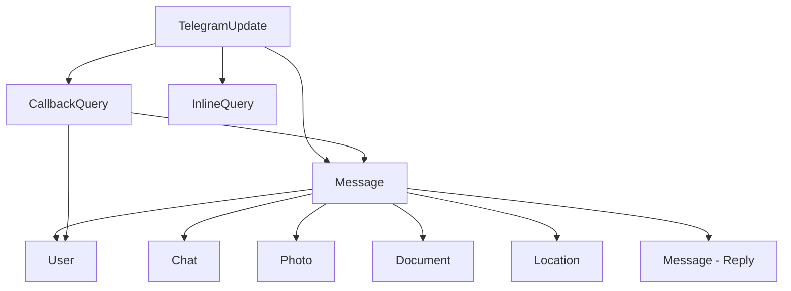

# Design Document

## Overview

The Telegram DTO Library is a framework-agnostic PHP package that provides strongly-typed Data Transfer Objects for the Telegram Bot API. Based on comprehensive analysis of the `defstudio/telegraph` project (source available at `#[[file:vendor_sources/telegraph/]]` with analysis at `#[[file:vendor_sources/telegraph-analysis.md]]`), the library will extract and generalize **118 relevant files** including:

- **45 DTO classes** representing all Telegram API entities (User, Chat, Message, TelegramUpdate, media types, payments, etc.)
- **5 Enum classes** for constants (ChatActions, Permissions, Emojis, etc.)
- **4 Keyboard classes** for inline and reply keyboards
- **11 Exception classes** for comprehensive error handling
- **3 Contract interfaces** for extensibility

The library serves as a clean, strongly-typed data layer that can be used by any PHP framework or standalone application to work with Telegram Bot API responses in a type-safe manner.

**Project Information:**
- **Organization**: FardaDev (https://github.com/FardaDev)
- **Repository**: https://github.com/FardaDev/telegram-objects-php
- **Maintainer**: Mansour M (https://github.com/MansourM)

**Source Attribution:**
- Simple header format: reference to original file and extraction date
- Maintains traceability to Telegraph source files
- General Telegraph attribution in project README

## Architecture

### Core Design Principles

1. **Framework Agnostic**: No dependencies on Laravel, Symfony, or other frameworks
2. **Strict Typing**: All properties use PHP 8.2+ strict types with readonly where appropriate
3. **Immutable Objects**: DTOs are created via static factory methods and cannot be modified after creation
4. **PSR Compliance**: Follows PSR-4 autoloading and PSR-12 coding standards
5. **Upstream Synchronization**: Maintains tracking mechanism to stay in sync with Telegraph updates

### Package Structure

```
src/
├── DTO/                    # 45 Core Telegram API objects
│   ├── TelegramUpdate.php  # Main webhook payload
│   ├── Message.php         # Complex message with media
│   ├── User.php, Chat.php  # Core entities
│   ├── Photo.php, Video.php, Audio.php, Document.php  # Media objects
│   ├── CallbackQuery.php, InlineQuery.php  # Interactive objects
│   ├── Poll.php, Invoice.php  # Specialized objects
│   └── ... (35 more DTO classes)
├── Enums/                  # 5 Constant classes
│   ├── ChatActions.php     # typing, uploading, etc.
│   ├── ChatPermissions.php # User/admin permissions
│   ├── Emojis.php         # Game/poll emojis
│   └── ReplyButtonType.php # Button types
├── Keyboard/               # 4 Keyboard classes
│   ├── Keyboard.php        # Inline keyboards
│   ├── Button.php          # Inline buttons
│   ├── ReplyKeyboard.php   # Reply keyboards
│   └── ReplyButton.php     # Reply buttons
├── Contracts/              # 3 Framework-agnostic interfaces
│   ├── ArrayableInterface.php
│   ├── StorageInterface.php
│   └── DownloadableInterface.php
├── Exceptions/             # 11 Exception classes
│   ├── TelegramException.php  # Base exception
│   ├── ValidationException.php
│   ├── FileException.php
│   └── ... (8 more specialized exceptions)
└── Support/                # Utility classes
    ├── Collection.php      # Lightweight collection
    └── TelegramDateTime.php # Date/time handling

tests/
├── Unit/
│   ├── DTO/               # 45 DTO unit tests
│   ├── Enums/             # Enum tests
│   ├── Keyboard/          # Keyboard tests
│   └── Exceptions/        # Exception tests
├── storage/               # Test files (audio, video, etc.)
└── Integration/           # Integration tests

scripts/
└── check-upstream.php     # Upstream synchronization

docs/
├── contributing.md
└── upstream-sync.md

examples/
├── basic-usage.php
├── webhook-parsing.php
└── keyboard-examples.php
```

## Components and Interfaces

### 1. DTO Base Structure

All DTO classes follow a consistent pattern with source attribution:

```php
<?php declare(strict_types=1);

/**
 * Extracted from: vendor_sources/telegraph/src/DTO/User.php
 * Telegraph commit: 0f4a6cf4
 * Date: 2025-11-06
 */

namespace Telegram\Objects\DTO;

use Telegram\Objects\Contracts\ArrayableInterface;

class User implements ArrayableInterface
{
    private function __construct(
        private readonly int $id,
        private readonly bool $isBot,
        private readonly string $firstName,
        private readonly ?string $lastName = null,
        // ... other properties
    ) {}

    public static function fromArray(array $data): self
    {
        // Validation and object creation
    }

    public function toArray(): array
    {
        // Serialization logic
    }

    // Getter methods for all properties
}
```

### 2. Framework-Agnostic Interfaces

**ArrayableInterface** - Replaces Laravel's `Arrayable`:
```php
interface ArrayableInterface
{
    public function toArray(): array;
}
```

**SerializableInterface** - For objects that can be created from arrays:
```php
interface SerializableInterface
{
    public static function fromArray(array $data): self;
}
```

### 3. Lightweight Collection Implementation

A minimal collection class to replace Laravel's Collection dependency:

```php
class Collection implements \IteratorAggregate, \Countable, ArrayableInterface
{
    public function __construct(private array $items = []) {}
    
    public static function make(array $items = []): self;
    public function map(callable $callback): self;
    public function filter(?callable $callback = null): self;
    public function toArray(): array;
    // Essential collection methods only
}
```

### 4. Date/Time Handling

A lightweight wrapper for date handling without Carbon dependency:

```php
class TelegramDateTime
{
    public static function fromTimestamp(int $timestamp): \DateTimeImmutable;
    public function toISOString(): string;
}
```

## Data Models

### Core Telegram Objects

Based on comprehensive analysis of Telegraph's source code, the library will include **45 DTO classes**:

**Primary Objects (4):**
- `TelegramUpdate` - Main webhook payload container
- `Message` - Complex message object with all media attachments
- `User` - Telegram user information with premium status
- `Chat` - Chat/channel information with forum support

**Media Objects (9):**
- `Photo`, `Video`, `Audio`, `Voice`, `Document` - Core media file DTOs
- `Animation`, `Sticker` - Animated content DTOs
- `Location`, `Venue`, `Contact` - Location and contact DTOs

**Interactive Objects (15):**
- `CallbackQuery` - Inline keyboard button callbacks
- `InlineQuery` + 11 `InlineQueryResult*` classes - Inline bot queries and results
- `Poll`, `PollAnswer`, `PollOption` - Poll system DTOs

**Payment Objects (6):**
- `Invoice`, `SuccessfulPayment`, `RefundedPayment` - Payment flow DTOs
- `PreCheckoutQuery`, `OrderInfo`, `ShippingAddress` - Payment details

**Administrative Objects (8):**
- `ChatMember`, `ChatMemberUpdate` - Chat membership management
- `ChatInviteLink`, `ChatJoinRequest` - Chat access control
- `Reaction`, `ReactionType` - Message reactions
- `Entity` - Message entities (mentions, hashtags, URLs, etc.)
- `WriteAccessAllowed` - Permission change notifications

**Utility Objects (3):**
- `Attachment` - File attachment handling
- Additional specialized DTOs for edge cases

### Enum Classes (5)

**Constants and Configuration:**
- `ChatActions` - Chat action constants (typing, uploading, recording, etc.)
- `ChatAdminPermissions` - Administrator permission flags
- `ChatPermissions` - User permission flags
- `Emojis` - Emoji constants for games and polls
- `ReplyButtonType` - Reply keyboard button type constants

### Keyboard System (4)

**Interactive Elements:**
- `Keyboard` - Inline keyboard builder with button management
- `Button` - Individual inline keyboard button with actions/URLs
- `ReplyKeyboard` - Reply keyboard builder with layout control
- `ReplyButton` - Reply keyboard button with special request types

### Object Relationships



### Data Validation Strategy

**Consistent Validation Approach:**
All DTO constructors validate input data using the centralized `Validator` class to ensure consistency across the entire library:

- **Required Fields**: Use `Validator::requireField($data, 'field_name', 'ContextClass')` for all required fields
- **Optional Fields**: Use `Validator::getValue($data, 'field_name', $default, 'expected_type')` for optional fields with defaults
- **Type Validation**: Automatic type checking through Validator methods
- **Enum Validation**: Use `Validator::validateEnum($value, 'field_name', $validValues)` for enum constraints
- **Range Validation**: Use `Validator::validateRange($value, 'field_name', $min, $max)` for numeric ranges
- **Custom Validation**: Use specialized Validator methods like `validateUrl()` for format validation

**Validation Consistency Rules:**
- **NEVER** use manual `isset()` checks or direct array access in `fromArray()` methods
- **ALWAYS** use `Validator::requireField()` for required fields instead of manual ValidationException throws
- **ALWAYS** use `Validator::getValue()` for optional fields instead of `$data['field'] ?? null`
- **ALWAYS** import `use Telegram\Objects\Support\Validator;` in DTO classes
- **MAINTAIN** consistent error message formatting through Validator class methods

**Implementation Pattern:**
```php
public static function fromArray(array $data): self
{
    // Validate required fields
    Validator::requireField($data, 'id', 'User');
    Validator::requireField($data, 'first_name', 'User');
    
    // Extract values with type validation
    $id = Validator::getValue($data, 'id', null, 'int');
    $firstName = Validator::getValue($data, 'first_name', null, 'string');
    $lastName = Validator::getValue($data, 'last_name', null, 'string');
    $isBot = Validator::getValue($data, 'is_bot', false, 'bool');
    
    // Additional validation as needed
    Validator::validateRange($id, 'id', 1);
    
    return new self($id, $isBot, $firstName, $lastName);
}
```

**Nested Object Creation**: Recursively create child DTOs using the same validation approach
**Error Propagation**: Allow validation errors from nested objects to bubble up with context

## Error Handling

### Exception Hierarchy

```php
namespace Telegram\Objects\Exceptions;

class TelegramException extends \Exception {}
class ValidationException extends TelegramException {}
class SerializationException extends TelegramException {}
```

### Error Scenarios

1. **Invalid Input Data**: Missing required fields, wrong data types
2. **Nested Object Errors**: Propagate validation errors from child objects
3. **Serialization Errors**: Handle circular references, invalid data states

## Testing Strategy

### Unit Testing Approach

Following the patterns observed in Telegraph's test suite:

1. **Property Coverage Tests**: Verify all properties are included in `toArray()` output
2. **Serialization Round-trip Tests**: Ensure `fromArray()` → `toArray()` consistency
3. **Validation Tests**: Test required field validation and error conditions
4. **Edge Case Tests**: Handle null values, empty arrays, malformed data

### Test Structure

```php
// Example test pattern from Telegraph
it('exports all properties to array', function () {
    $dto = User::fromArray([
        'id' => 1,
        'is_bot' => true,
        'first_name' => 'John',
        // ... complete data
    ]);

    $array = $dto->toArray();

    $reflection = new ReflectionClass($dto);
    foreach ($reflection->getProperties() as $property) {
        expect($array)->toHaveKey($property->getName());
    }
});
```

### Test Data Management

- Use realistic Telegram API response samples
- Create test fixtures for complex nested objects
- Implement data builders for test object creation

## Upstream Synchronization

### Tracking Mechanism

**upstream.json** file structure:
```json
{
    "source": "defstudio/telegraph",
    "last_commit": "abc123...",
    "last_checked": "2025-11-06T16:50:00Z",
    "tracked_files": [
        "src/DTO/*.php",
        "tests/Unit/DTO/*.php"
    ]
}
```

### Synchronization Script

**scripts/check-upstream.php** functionality:
1. Fetch latest Telegraph repository state
2. Compare commit hashes to detect changes
3. Generate diff report for DTO modifications
4. Identify new DTOs or removed DTOs
5. Flag breaking changes in existing DTOs

### Sync Process

1. **Automated Checks**: Run sync check in CI/CD pipeline
2. **Change Detection**: Identify modified DTO files
3. **Impact Analysis**: Assess breaking vs non-breaking changes
4. **Update Strategy**: Manual review and adaptation of changes
5. **Version Bumping**: Follow semantic versioning for updates

## Implementation Phases

### Phase 1: Core Infrastructure
- Set up package structure and composer configuration
- Implement base interfaces and utility classes
- Create validation and exception handling

### Phase 2: Primary DTOs
- Implement core objects: User, Chat, Message, TelegramUpdate
- Add comprehensive test coverage
- Validate serialization/deserialization

### Phase 3: Extended DTOs
- Implement all media and interactive objects
- Add payment and administrative objects
- Complete test suite

### Phase 4: Upstream Integration
- Implement tracking mechanism
- Create synchronization script
- Set up automated monitoring

## Performance Considerations

### Memory Efficiency
- Use readonly properties to prevent accidental mutations
- Implement lazy loading for complex nested objects where beneficial
- Avoid unnecessary object cloning

### Serialization Performance
- Cache reflection data for property mapping
- Optimize array filtering in `toArray()` methods
- Use efficient data structures for collections

## Security Considerations

### Input Validation
- Sanitize all input data in `fromArray()` methods
- Validate data types and ranges
- Prevent injection attacks through proper escaping

### Data Exposure
- Ensure sensitive data is not logged in exceptions
- Implement proper toString() methods that don't expose secrets
- Consider data masking for debugging output